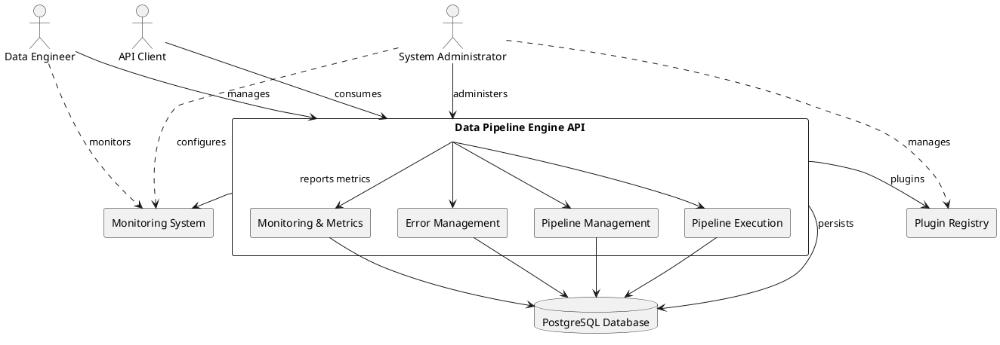
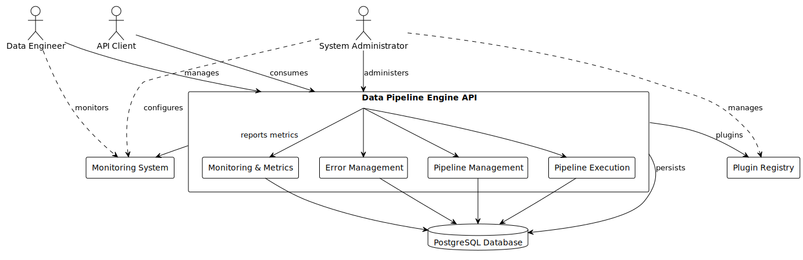
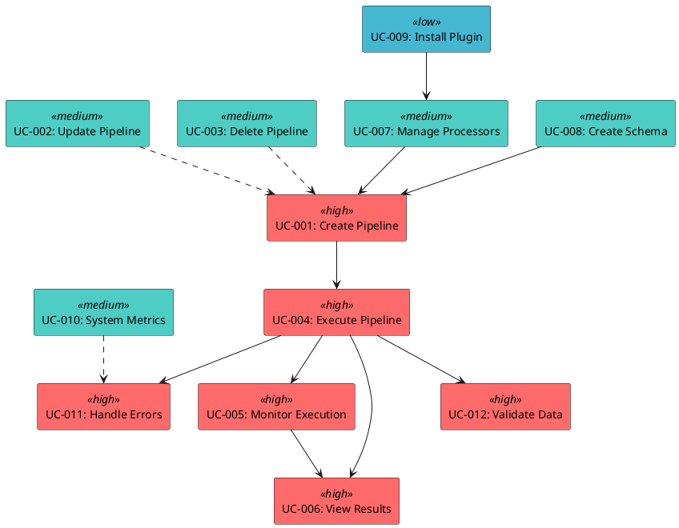
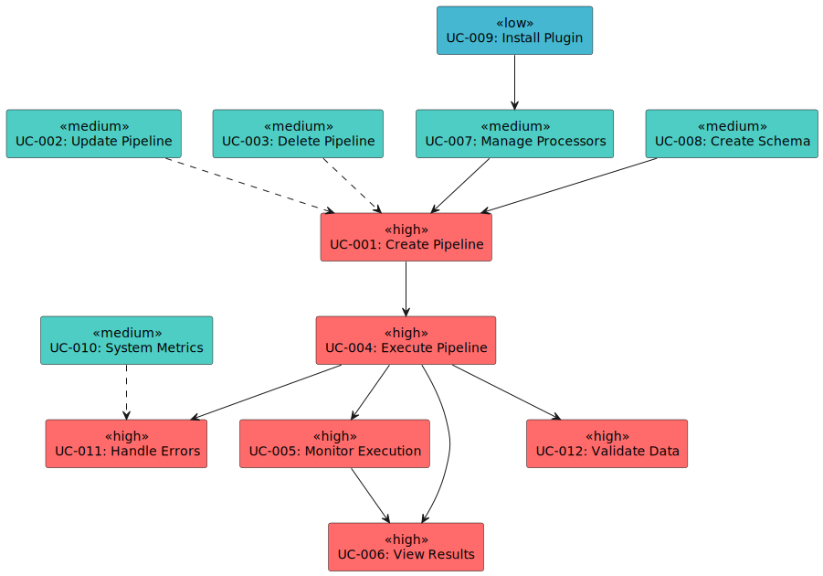

# Use Cases Specification

## Data Pipeline Engine

**Version:** 1.0  
**Date:** September 2025  
**Document Type:** Functional Requirements Specification  
**Document Status:** Draft

---

## Document Information

| Field | Value                           |
|-------|---------------------------------|
| **Project Name** | Data Pipeline Engine            |
| **Document Title** | Use Cases Specification         |
| **Version** | 1.0                             |
| **Date** | September 2025                  |
| **Author(s)** | Andres Jimenez                  |
| **Document Status** | Draft → Under Review → Approved |
| **Classification** | Open Source Project             |

---

## 1. Introduction

### 1.1 Purpose

This document defines the functional requirements of the Data Pipeline Engine through detailed use cases. Each use case describes how actors interact with the system to achieve specific goals, including normal flows, alternative flows, and exception scenarios.

This specification serves as:

- **Functional blueprint** for system implementation
- **Requirements baseline** for development teams
- **Test scenario source** for quality assurance
- **Communication tool** between stakeholders and developers

### 1.2 Scope

This document covers all primary and secondary use cases for the Data Pipeline Engine v1.0, including:

- Pipeline management operations (CRUD)
- Data processing and execution workflows
- System monitoring and observability
- Error handling and recovery scenarios
- Schema and processor management

### 1.3 Actors Definition

#### 1.3.1 Primary Actors

**Data Engineer**

- **Role**: Technical user responsible for data pipeline creation and management
- **Skills**: High technical proficiency (3-10+ years experience)
- **Responsibilities**: Design pipelines, troubleshoot issues, monitor performance
- **System Access**: Full pipeline management capabilities via REST API

**System Administrator**

- **Role**: User responsible for system configuration, deployment, and maintenance
- **Skills**: System administration and DevOps background
- **Responsibilities**: System deployment, monitoring, security, plugin management
- **System Access**: Administrative functions, system metrics, configuration management

**API Client**

- **Role**: External system or application consuming pipeline services
- **Type**: Programmatic interface (applications, scripts, services)
- **Responsibilities**: Submit data for processing, consume processing results
- **System Access**: Pipeline execution endpoints, status monitoring

#### 1.3.2 Secondary Actors

**Database System**

- **Role**: PostgreSQL database providing data persistence
- **Responsibilities**: Store configurations, execution history, metrics

**Monitoring System**

- **Role**: External monitoring tools (Prometheus, Grafana, etc.)
- **Responsibilities**: Collect metrics, provide alerting and dashboards

**Plugin Registry**

- **Role**: External repository for custom processor plugins
- **Responsibilities**: Provide downloadable processor extensions

### 1.4 References

| Document | Version | Description |
|----------|---------|-------------|
| [Project Charter](Project-Charter.md) | 1.0 | Project vision and objectives |
| [Software Requirements Specification](Requirements.md) | 1.0 | Detailed system requirements |
| [Glossary of Terms](Glossary.md) | 1.0 | Domain terminology definitions |
| Domain Model | 1.0 | Core business entities |
| Entity Relationship Diagram | 1.0 | Database design |

### 1.5 Document Structure

- **Section 2**: Actor relationships and system overview
- **Section 3**: Use case summary and prioritization
- **Section 4**: Detailed use case specifications (UC-001 through UC-012)
- **Section 5**: Use case relationships and dependencies
- **Section 6**: Business rules and constraints
- **Section 7**: Acceptance criteria and traceability

---

## 2. Actor Relationships and System Context

### 2.1 Actor Interaction Diagram






### 2.2 System Context Diagram

```
┌─────────────────────────────────────────────────────────────────────────┐
│                          Data Pipeline Engine System                    │
│                                                                         │
│  ┌─────────────┐  ┌─────────────────────┐  ┌─────────────────────┐      │
│  │   Pipeline  │  │    Data Processing  │  │     Monitoring      │      │
│  │ Management  │◄─┤       Engine        │─►│   & Observability   │      │
│  └─────────────┘  └─────────────────────┘  └─────────────────────┘      │
│         │                     │                           │             │
│         ▼                     ▼                           ▼             │
│  ┌─────────────┐  ┌─────────────────────┐  ┌─────────────────────┐      │
│  │   Schema    │  │      Processor      │  │       Error         │      │
│  │ Management  │  │      Chain          │  │      Handling       │      │
│  └─────────────┘  └─────────────────────┘  └─────────────────────┘      │
└─────────────────────────────────────────────────────────────────────────┘
           │                     │                           │
    ┌─────────────┐    ┌─────────────────┐    ┌─────────────────────┐
    │    Data     │    │     System      │    │    API Client       │
    │  Engineer   │    │ Administrator   │    │   (Applications)    │
    └─────────────┘    └─────────────────┘    └─────────────────────┘
```

---

## 3. Use Case Overview

### 3.1 Use Case Summary Table

| Use Case ID | Use Case Name | Primary Actor | Priority | Complexity | Business Value |
|-------------|---------------|---------------|----------|-------------|----------------|
| UC-001 | Create Pipeline | Data Engineer | High | Medium | Core functionality |
| UC-002 | Update Pipeline Configuration | Data Engineer | High | Medium | Configuration flexibility |
| UC-003 | Delete Pipeline | Data Engineer | Medium | Low | Lifecycle management |
| UC-004 | Execute Pipeline | API Client | High | High | Primary system function |
| UC-005 | Monitor Pipeline Execution | Data Engineer | High | Medium | Operational visibility |
| UC-006 | View Execution Results | Data Engineer | High | Low | Results analysis |
| UC-007 | Manage Processors | Data Engineer | Medium | Medium | Processing flexibility |
| UC-008 | Create Custom Schema | Data Engineer | Medium | Medium | Data validation |
| UC-009 | Install Plugin Processor | System Administrator | Low | High | System extensibility |
| UC-010 | View System Metrics | System Administrator | Medium | Low | System monitoring |
| UC-011 | Handle Execution Errors | System | High | High | System resilience |
| UC-012 | Validate Data Against Schema | System | High | Medium | Data integrity |

### 3.2 Use Case Priority Matrix

```
High Priority (Must Have - v1.0)
├── UC-001: Create Pipeline
├── UC-002: Update Pipeline Configuration  
├── UC-004: Execute Pipeline
├── UC-005: Monitor Pipeline Execution
├── UC-006: View Execution Results
├── UC-011: Handle Execution Errors
└── UC-012: Validate Data Against Schema

Medium Priority (Should Have - v1.0)
├── UC-003: Delete Pipeline
├── UC-007: Manage Processors
├── UC-008: Create Custom Schema
└── UC-010: View System Metrics

Low Priority (Could Have - v1.1+)
└── UC-009: Install Plugin Processor
```

### 3.3 Actor-Use Case Matrix

| Use Case | Data Engineer | System Administrator | API Client | System |
|----------|--------------|---------------------|------------|--------|
| UC-001 | Primary | - | - | - |
| UC-002 | Primary | - | - | - |
| UC-003 | Primary | - | - | - |
| UC-004 | - | - | Primary | Supporting |
| UC-005 | Primary | Secondary | - | - |
| UC-006 | Primary | - | - | - |
| UC-007 | Primary | - | - | - |
| UC-008 | Primary | - | - | - |
| UC-009 | - | Primary | - | Supporting |
| UC-010 | - | Primary | - | - |
| UC-011 | - | - | - | Primary |
| UC-012 | - | - | - | Primary |

---

## 4. Detailed Use Case Specifications

## UC-001: Create Pipeline

### Basic Information

- **Use Case ID**: UC-001
- **Use Case Name**: Create Pipeline
- **Primary Actor**: Data Engineer
- **Goal in Context**: Create a new data processing pipeline with configured processors and schemas
- **Scope**: System
- **Level**: User Goal
- **Priority**: High
- **Complexity**: Medium

### Stakeholders and Interests

- **Data Engineer**: Wants to quickly create reliable, reusable data processing workflows
- **System**: Needs to validate configuration and maintain data integrity
- **Future Users**: Need well-documented, maintainable pipeline configurations
- **API Clients**: Require stable pipeline interfaces for integration

### Preconditions

- Data Engineer has valid authentication credentials
- System is operational and database is accessible
- User has necessary permissions to create pipelines
- Required input and output schemas are available or will be created

### Success Guarantee (Postconditions)

- New pipeline is created and stored in the system
- Pipeline has valid configuration and can be executed
- Pipeline appears in pipeline listings with ACTIVE status
- System logs pipeline creation event with audit trail
- Pipeline ID is generated and returned to user

### Main Success Scenario

1. **Data Engineer** sends HTTP POST request to `/api/pipelines` with pipeline configuration
2. **System** validates the authentication credentials and permissions
3. **Data Engineer** provides complete pipeline configuration including:
    - Pipeline name and description
    - Input schema definition (JSON Schema format)
    - Output schema definition (JSON Schema format)
    - Ordered list of processors with configurations
    - Optional metadata and tags
4. **System** validates the input schema format and semantic correctness
5. **System** validates the output schema format and semantic correctness
6. **System** validates each processor configuration:
    - Verifies processor type is supported (VALIDATOR, CLEANER, TRANSFORMER)
    - Validates processor-specific configuration against schema
    - Checks execution order is sequential and unique
7. **System** validates the overall pipeline configuration:
    - Ensures at least one processor is configured
    - Validates logical processor ordering and compatibility
    - Checks schema compatibility between input, processors, and output
8. **System** generates unique pipeline UUID
9. **System** persists pipeline configuration to database within transaction
10. **System** sets pipeline status to ACTIVE
11. **System** creates audit log entry for pipeline creation
12. **System** returns HTTP 201 Created with pipeline details and ID

### Extensions (Alternative Flows)

#### 2a. Invalid Authentication

- 2a1. System detects invalid or missing authentication credentials
- 2a2. System returns HTTP 401 Unauthorized with error details
- 2a3. Use case ends in failure

#### 3a. Missing Required Configuration

- 3a1. System detects missing required fields (name, schemas, processors)
- 3a2. System returns HTTP 400 Bad Request with validation errors
- 3a3. Data Engineer corrects configuration and resubmits
- 3a4. Resume at step 3

#### 4a. Invalid Input Schema

- 4a1. System detects invalid JSON Schema format or syntax errors
- 4a2. System returns HTTP 400 Bad Request with specific schema errors
- 4a3. Data Engineer corrects schema definition and resubmits
- 4a4. Resume at step 4

#### 5a. Invalid Output Schema

- 5a1. System detects invalid JSON Schema format or syntax errors
- 5a2. System returns HTTP 400 Bad Request with specific schema errors
- 5a3. Data Engineer corrects schema definition and resubmits
- 5a4. Resume at step 5

#### 6a. Invalid Processor Configuration

- 6a1. System detects invalid processor type or configuration
- 6a2. System identifies specific validation errors with field details
- 6a3. System returns HTTP 400 Bad Request with detailed error response
- 6a4. Data Engineer corrects processor configuration and resubmits
- 6a5. Resume at step 6

#### 7a. Pipeline Logic Validation Failure

- 7a1. System detects logical inconsistencies in pipeline design
- 7a2. System returns HTTP 400 Bad Request with recommendations for fixes
- 7a3. Data Engineer adjusts pipeline configuration and resubmits
- 7a4. Resume at step 7

#### 9a. Database Connection Error

- 9a1. System cannot establish connection to database
- 9a2. System returns HTTP 500 Internal Server Error
- 9a3. System logs error details for administrator review
- 9a4. Use case ends in failure

#### 9b. Duplicate Pipeline Name

- 9b1. System detects pipeline name already exists for user
- 9b2. System returns HTTP 409 Conflict error with existing pipeline details
- 9b3. Data Engineer provides different name or updates existing pipeline
- 9b4. Resume at step 9

### Special Requirements

- **Performance**: Pipeline creation must complete within 2 seconds for typical configurations
- **Security**: All input data must be validated and sanitized against injection attacks
- **Usability**: Error messages must be clear, actionable, and include field-level details
- **Reliability**: Configuration must be atomically saved or completely rolled back on failure
- **Auditability**: All creation attempts must be logged with user and timestamp

### Technology and Data Variations

- **Input Format**: JSON via HTTP POST request body
- **Schema Format**: JSON Schema draft-07 or later
- **Database**: PostgreSQL with ACID transaction compliance
- **Authentication**: HTTP Basic Authentication (extensible to OAuth2)

### Frequency of Occurrence

- **Expected**: 5-20 pipeline creations per day in production environment
- **Peak**: Up to 50 pipeline creations during initial system adoption or major data migrations

---

## UC-002: Update Pipeline Configuration

### Basic Information

- **Use Case ID**: UC-002
- **Use Case Name**: Update Pipeline Configuration
- **Primary Actor**: Data Engineer
- **Goal in Context**: Modify existing pipeline configuration while preserving execution history
- **Scope**: System
- **Level**: User Goal
- **Priority**: High
- **Complexity**: Medium

### Stakeholders and Interests

- **Data Engineer**: Wants to modify pipelines without losing historical data
- **System**: Needs to maintain configuration integrity and version control
- **API Clients**: Require backward compatibility and minimal disruption

### Preconditions

- Pipeline exists in the system and is accessible
- Data Engineer has valid authentication and update permissions
- Pipeline is not currently in RUNNING execution status (optional constraint)

### Success Guarantee (Postconditions)

- Pipeline configuration is updated successfully
- Previous configuration is preserved in version history
- Pipeline remains functional and executable
- Update event is logged for audit trail
- Version number is incremented

### Main Success Scenario

1. **Data Engineer** sends HTTP PUT request to `/api/pipelines/{pipelineId}` with updated configuration
2. **System** validates authentication credentials and update permissions
3. **System** retrieves existing pipeline configuration from database
4. **System** validates pipeline exists and current user has modification rights
5. **Data Engineer** provides updated configuration (partial or complete update)
6. **System** merges new configuration with existing configuration, preserving unchanged fields
7. **System** validates updated configuration using same validation rules as creation:
    - Schema format validation
    - Processor configuration validation
    - Pipeline logic validation
8. **System** creates backup copy of previous configuration with version number
9. **System** updates pipeline configuration in database within transaction
10. **System** increments pipeline version number
11. **System** creates audit log entry for configuration change
12. **System** returns HTTP 200 OK with updated pipeline details

### Extensions (Alternative Flows)

#### 3a. Pipeline Not Found

- 3a1. System cannot locate pipeline with provided ID
- 3a2. System returns HTTP 404 Not Found with error details
- 3a3. Use case ends in failure

#### 4a. Insufficient Permissions

- 4a1. User does not have update permissions for specified pipeline
- 4a2. System returns HTTP 403 Forbidden with permission details
- 4a3. Use case ends in failure

#### 4b. Pipeline Currently Executing

- 4b1. System detects pipeline has active executions in RUNNING status
- 4b2. System returns HTTP 409 Conflict with active execution details
- 4b3. Data Engineer waits for executions to complete or forces update with --force flag
- 4b4. If forcing update, system logs warning and resumes at step 6

#### 7a. Configuration Validation Failure

- 7a1. Updated configuration fails one or more validation rules
- 7a2. System returns HTTP 400 Bad Request with detailed validation errors
- 7a3. Data Engineer reviews errors and corrects configuration
- 7a4. Resume at step 6

#### 9a. Version Conflict

- 9a1. Another user has modified the pipeline since current user retrieved it
- 9a2. System detects version mismatch using optimistic locking
- 9a3. System returns HTTP 409 Conflict with latest version details
- 9a4. Data Engineer must refresh and reapply changes

### Special Requirements

- **Concurrency**: Must handle concurrent updates using optimistic locking
- **Versioning**: Must preserve complete history of configuration changes
- **Backward Compatibility**: Updates should not break existing API client integrations
- **Validation**: All validation rules from UC-001 apply to updates

---

## UC-003: Delete Pipeline

### Basic Information

- **Use Case ID**: UC-003
- **Use Case Name**: Delete Pipeline
- **Primary Actor**: Data Engineer
- **Goal in Context**: Remove pipeline from active system while preserving execution history
- **Scope**: System
- **Level**: User Goal
- **Priority**: Medium
- **Complexity**: Low

### Preconditions

- Pipeline exists in the system
- Data Engineer has valid authentication and delete permissions
- No active executions are in RUNNING status for the pipeline

### Success Guarantee (Postconditions)

- Pipeline is marked as deleted (soft delete)
- Pipeline no longer appears in active pipeline listings
- Execution history is preserved for audit and analysis purposes
- Deletion event is logged with timestamp and user

### Main Success Scenario

1. **Data Engineer** sends HTTP DELETE request to `/api/pipelines/{pipelineId}`
2. **System** validates authentication credentials and delete permissions
3. **System** retrieves pipeline configuration and validates it exists
4. **System** checks for active executions in RUNNING or PENDING status
5. **System** marks pipeline as deleted (soft delete) by setting `is_deleted = true`
6. **System** updates pipeline status to ARCHIVED
7. **System** creates audit log entry for deletion event
8. **System** returns HTTP 204 No Content confirmation

### Extensions (Alternative Flows)

#### 4a. Active Executions Exist

- 4a1. System detects executions in RUNNING or PENDING status
- 4a2. System returns HTTP 409 Conflict with active execution list
- 4a3. Data Engineer chooses to wait for completion or force delete with `--force` parameter
- 4a4. If force delete chosen, system cancels pending executions and continues

#### 4b. Referenced by Other Pipelines

- 4b1. System detects pipeline is referenced by other configurations
- 4b2. System returns HTTP 409 Conflict with dependency list
- 4b3. Data Engineer must resolve dependencies first

---

## UC-004: Execute Pipeline

### Basic Information

- **Use Case ID**: UC-004
- **Use Case Name**: Execute Pipeline
- **Primary Actor**: API Client
- **Goal in Context**: Process a batch of data through a configured pipeline
- **Scope**: System
- **Level**: User Goal
- **Priority**: High
- **Complexity**: High

### Stakeholders and Interests

- **API Client**: Wants reliable, fast data processing with clear results
- **Data Engineer**: Wants comprehensive monitoring and error reporting
- **System**: Needs to maintain data integrity and performance under load
- **Business Users**: Require accurate data processing for business operations

### Preconditions

- Pipeline exists in system and has ACTIVE status
- API Client has valid authentication credentials
- Input data is provided in request body conforming to expected format
- System has sufficient resources (CPU, memory, database connections)

### Success Guarantee (Postconditions)

- Data is processed according to pipeline configuration
- Execution record is created and stored with complete metadata
- Processing results are available via API response and stored persistently
- Comprehensive metrics and logs are collected for monitoring and troubleshooting

### Main Success Scenario

1. **API Client** sends HTTP POST to `/api/pipelines/{pipelineId}/execute` with data batch
2. **System** validates authentication credentials and execution permissions
3. **System** retrieves pipeline configuration and validates it is ACTIVE status
4. **System** creates new execution record with PENDING status and unique execution ID
5. **System** validates input data batch against pipeline input schema (UC-012)
6. **System** initializes execution metrics and logging context
7. **System** updates execution status to RUNNING and records start timestamp
8. **System** processes each data item through the processor chain:

   **For each data item in batch:**

    - 8a. Set data item status to PROCESSING
    - 8b. Execute first processor in chain (typically Validator)
    - 8c. If processor succeeds, pass result to next processor in sequence
    - 8d. If processor fails, mark data item as FAILED, log error, continue with next item
    - 8e. Repeat for all processors in chain until completion or failure
    - 8f. If all processors succeed, mark data item as PROCESSED
    - 8g. Update execution metrics (processed count, success/failure rates)

9. **System** validates all processed data against pipeline output schema (UC-012)
10. **System** compiles final execution results and comprehensive metrics
11. **System** updates execution status to COMPLETED and records end timestamp
12. **System** persists execution record, results, and metrics to database
13. **System** returns HTTP 200 OK with execution results, metrics, and execution ID

### Extensions (Alternative Flows)

#### 3a. Pipeline Not Found or Inactive

- 3a1. System cannot find pipeline or pipeline status is not ACTIVE
- 3a2. System returns HTTP 404 Not Found or HTTP 409 Conflict
- 3a3. Use case ends in failure

#### 5a. Input Data Schema Validation Failure (Partial)

- 5a1. One or more data items fail input schema validation
- 5a2. System logs detailed validation errors with item identifiers
- 5a3. System excludes invalid items from processing pipeline
- 5a4. System continues execution with valid data items only
- 5a5. System includes validation errors in final execution results
- 5a6. Resume at step 6

#### 5b. Input Data Schema Validation Failure (Complete)

- 5b1. All data items fail input schema validation
- 5b2. System updates execution status to FAILED
- 5b3. System returns HTTP 400 Bad Request with comprehensive validation error details
- 5b4. Use case ends in failure

#### 8a. Critical System Error During Processing

- 8a1. System encounters critical error (OutOfMemory, DatabaseConnection failure)
- 8a2. System updates execution status to FAILED
- 8a3. System logs critical error with full stack trace and system context
- 8a4. System performs cleanup of partial results and releases resources
- 8a5. System returns HTTP 500 Internal Server Error with error ID for tracking
- 8a6. Use case ends in failure

#### 8b. Processor Timeout

- 8b1. Individual processor execution exceeds configured timeout limit
- 8b2. System terminates processor execution gracefully
- 8b3. System marks affected data items as FAILED with timeout error
- 8b4. System logs timeout error with processor and data item details
- 8b5. System continues processing remaining data items with next processor
- 8b6. Resume at step 8 for next data item

#### 8c. Resource Exhaustion

- 8c1. System detects memory or CPU resource exhaustion
- 8c2. System applies throttling to reduce processing load
- 8c3. System continues processing at reduced rate
- 8c4. System logs resource exhaustion warning
- 8c5. Resume processing with throttling applied

#### 9a. Output Schema Validation Failure

- 9a1. Processed data items fail output schema validation
- 9a2. System marks affected items as FAILED with validation errors
- 9a3. System logs output validation errors with item details
- 9a4. System continues with items that pass output validation
- 9a5. Resume at step 10

### Special Requirements

- **Performance**: Must process minimum 1,000 records/second for simple pipelines
- **Scalability**: Must handle batches up to 100,000 records without memory issues
- **Reliability**: Must maintain ACID properties for execution records and results
- **Monitoring**: Must provide real-time execution progress and detailed metrics
- **Security**: Must validate and sanitize all input data to prevent injection attacks
- **Recoverability**: Must support execution retry and partial result recovery

### Business Rules

- Each data item is processed independently to ensure failure isolation
- Processor order is strictly enforced as defined in pipeline configuration
- Execution timeout is configurable per pipeline (default 30 minutes)
- Failed data items do not stop processing of remaining items
- All execution attempts are logged regardless of success or failure

---

## UC-005: Monitor Pipeline Execution

### Basic Information

- **Use Case ID**: UC-005
- **Use Case Name**: Monitor Pipeline Execution
- **Primary Actor**: Data Engineer
- **Goal in Context**: Track real-time and historical pipeline execution performance and status
- **Scope**: System
- **Level**: User Goal
- **Priority**: High
- **Complexity**: Medium

### Preconditions

- Data Engineer has valid authentication and monitoring permissions
- Executions exist in the system (current or historical)
- Monitoring infrastructure is operational

### Success Guarantee (Postconditions)

- User receives comprehensive execution status and performance metrics
- Historical execution data is available for trend analysis
- Performance bottlenecks and issues are visible and actionable
- Real-time execution progress is accessible via API

### Main Success Scenario

1. **Data Engineer** sends HTTP GET to `/api/executions` with monitoring parameters
2. **System** validates authentication credentials and monitoring permissions
3. **Data Engineer** specifies monitoring criteria and filters:
    - Specific pipeline ID (optional filter)
    - Time range for historical data (start/end dates)
    - Execution status filter (PENDING, RUNNING, COMPLETED, FAILED)
    - Metrics granularity (summary vs detailed)
    - Pagination parameters for large result sets
4. **System** retrieves execution records matching specified criteria
5. **System** calculates aggregate metrics and performance indicators:
    - Success rates over time periods
    - Average and percentile execution times
    - Throughput metrics (records/second)
    - Error frequency and error pattern analysis
    - Resource utilization trends
6. **System** formats comprehensive monitoring response including:
    - List of current active executions with real-time status
    - Historical execution summary with trend analysis
    - Performance metrics dashboard data
    - Error statistics and categorization
    - System health indicators
7. **System** returns HTTP 200 OK with monitoring data and pagination metadata

### Extensions (Alternative Flows)

#### 4a. Large Dataset Performance Optimization

- 4a1. System detects request for large historical dataset (>10,000 executions)
- 4a2. System automatically applies pagination and result limiting
- 4a3. System returns paginated response with continuation tokens
- 4a4. System includes metadata about total available records
- 4a5. Data Engineer can request additional pages using continuation tokens

#### 4b. Real-time Monitoring Request

- 4b1. Data Engineer requests real-time updates for active executions
- 4b2. System establishes WebSocket connection for live updates
- 4b3. System streams execution status changes and metrics updates
- 4b4. Connection remains active until client disconnects

#### 5a. No Data Available

- 5a1. System finds no executions matching specified criteria
- 5a2. System returns HTTP 200 OK with empty results and explanatory message
- 5a3. System suggests alternative query parameters

---

## UC-006: View Execution Results

### Basic Information

- **Use Case ID**: UC-006
- **Use Case Name**: View Execution Results
- **Primary Actor**: Data Engineer
- **Goal in Context**: Review detailed results and analysis of a specific pipeline execution
- **Scope**: System
- **Level**: User Goal
- **Priority**: High
- **Complexity**: Low

### Preconditions

- Execution exists in system with specified execution ID
- Data Engineer has valid authentication and result viewing permissions
- Execution has completed (status: COMPLETED, FAILED, or CANCELLED)

### Success Guarantee (Postconditions)

- Complete execution details are retrieved and displayed
- Processing results are accessible with full context
- Error details and troubleshooting information are available
- Performance metrics provide actionable insights

### Main Success Scenario

1. **Data Engineer** sends HTTP GET to `/api/executions/{executionId}`
2. **System** validates authentication credentials and access permissions
3. **System** retrieves execution record and associated results from database
4. **System** compiles comprehensive execution report including:
    - **Execution metadata**: ID, pipeline ID, start/end timestamps, duration
    - **Input data summary**: Record count, data samples, validation results
    - **Processing results**: Successfully processed records with output samples
    - **Error analysis**: Failed records with detailed error messages and context
    - **Performance metrics**: Processing rates, resource usage, bottlenecks
    - **Status timeline**: Execution phase transitions and timing
5. **System** formats results with appropriate data masking for sensitive information
6. **System** returns HTTP 200 OK with comprehensive execution results

### Extensions (Alternative Flows)

#### 2a. Execution Not Found

- 2a1. System cannot locate execution with provided ID
- 2a2. System returns HTTP 404 Not Found with error details
- 2a3. Use case ends

#### 2b. Insufficient Permissions

- 2b1. User lacks permission to view specific execution results
- 2b2. System returns HTTP 403 Forbidden
- 2b3. Use case ends

#### 4a. Large Result Set

- 4a1. Execution results exceed response size limits
- 4a2. System returns paginated results with summary
- 4a3. System provides links to download complete results

---

## UC-007: Manage Processors

### Basic Information

- **Use Case ID**: UC-007
- **Use Case Name**: Manage Processors
- **Primary Actor**: Data Engineer
- **Goal in Context**: Create, configure, and manage individual processors for use in pipelines
- **Scope**: System
- **Level**: User Goal
- **Priority**: Medium
- **Complexity**: Medium

### Main Success Scenario

1. **Data Engineer** sends processor management request to appropriate endpoint
2. **System** validates authentication credentials and processor management permissions
3. **Data Engineer** specifies operation type and parameters:
    - **Create**: POST `/api/processors` with processor configuration
    - **Update**: PUT `/api/processors/{processorId}` with updated configuration
    - **Delete**: DELETE `/api/processors/{processorId}`
    - **List**: GET `/api/processors` with optional filters
4. **System** validates processor configuration against appropriate schema for processor type
5. **System** performs requested operation with appropriate validations
6. **System** updates processor registry and metadata
7. **System** returns operation result with confirmation details

### Extensions (Alternative Flows)

#### 3a. Delete Processor in Active Use

- 3a1. System detects processor is referenced by active pipelines
- 3a2. System returns HTTP 409 Conflict with list of dependent pipelines
- 3a3. Data Engineer must update pipelines first or confirm force deletion

---

## UC-008: Create Custom Schema

### Basic Information

- **Use Case ID**: UC-008
- **Use Case Name**: Create Custom Schema
- **Primary Actor**: Data Engineer
- **Goal in Context**: Define reusable data schemas for pipeline input/output validation
- **Scope**: System
- **Level**: User Goal
- **Priority**: Medium
- **Complexity**: Medium

### Preconditions

- Data Engineer has valid authentication and schema management permissions
- Schema definition follows JSON Schema specification (draft-07 or later)

### Success Guarantee (Postconditions)

- Custom schema is created and stored in schema registry
- Schema is available for use in pipeline configurations
- Schema validation rules are enforced for associated data

### Main Success Scenario

1. **Data Engineer** sends HTTP POST to `/api/schemas` with schema definition
2. **System** validates authentication credentials and schema creation permissions
3. **Data Engineer** provides complete schema specification:
    - Schema name and description
    - JSON Schema specification document
    - Version information
    - Field definitions with types and constraints
    - Optional metadata and tags
4. **System** validates JSON Schema syntax and semantic correctness
5. **System** checks for schema name conflicts within user namespace
6. **System** persists schema to registry with generated UUID
7. **System** returns HTTP 201 Created with schema details and ID

### Extensions (Alternative Flows)

#### 4a. Invalid JSON Schema

- 4a1. System detects syntax or semantic errors in schema definition
- 4a2. System returns HTTP 400 Bad Request with detailed validation errors
- 4a3. Data Engineer corrects schema and resubmits

#### 5a. Duplicate Schema Name

- 5a1. Schema name already exists in user's namespace
- 5a2. System returns HTTP 409 Conflict with existing schema details
- 5a3. Data Engineer provides different name or updates existing schema

---

## UC-009: Install Plugin Processor

### Basic Information

- **Use Case ID**: UC-009
- **Use Case Name**: Install Plugin Processor
- **Primary Actor**: System Administrator
- **Goal in Context**: Extend system functionality by installing custom processor plugins
- **Scope**: System
- **Level**: User Goal
- **Priority**: Low (v1.1+)
- **Complexity**: High

### Preconditions

- System Administrator has valid authentication and plugin management permissions
- Plugin package is available and follows required format
- System has plugin support enabled

### Success Guarantee (Postconditions)

- Plugin is validated, installed, and available in processor registry
- Custom processor type is available for use in pipelines
- Plugin documentation and examples are accessible

### Main Success Scenario

1. **System Administrator** uploads plugin package via POST `/api/plugins`
2. **System** validates authentication and administrative permissions
3. **System** validates plugin package integrity and format:
    - Package structure and manifest file
    - Digital signature verification (if required)
    - Required interface implementations
4. **System** performs security validation:
    - Code scanning for malicious patterns
    - Dependency analysis for vulnerabilities
    - Sandbox compatibility testing
5. **System** checks for conflicts with existing processors
6. **System** installs plugin to processor registry
7. **System** performs initialization and health checks
8. **System** makes plugin available for use in pipeline configurations
9. **System** creates audit log entry for plugin installation
10. **System** returns HTTP 201 Created with installation confirmation

### Extensions (Alternative Flows)

#### 3a. Invalid Plugin Package

- 3a1. Plugin package fails format or integrity validation
- 3a2. System returns HTTP 400 Bad Request with validation errors
- 3a3. Administrator corrects package and resubmits

#### 4a. Security Validation Failure

- 4a1. Plugin fails security scanning or contains vulnerabilities
- 4a2. System returns HTTP 403 Forbidden with security report
- 4a3. Plugin installation is rejected for security reasons

#### 5a. Plugin Conflict Detected

- 5a1. Plugin conflicts with existing processor or system component
- 5a2. System returns HTTP 409 Conflict with conflict details
- 5a3. Administrator resolves conflicts or forces installation with warnings

---

## UC-010: View System Metrics

### Basic Information

- **Use Case ID**: UC-010
- **Use Case Name**: View System Metrics
- **Primary Actor**: System Administrator
- **Goal in Context**: Monitor system health, performance, and resource utilization
- **Scope**: System
- **Level**: User Goal
- **Priority**: Medium
- **Complexity**: Low

### Preconditions

- System Administrator has valid authentication and metrics viewing permissions
- Monitoring infrastructure is operational and collecting metrics

### Success Guarantee (Postconditions)

- System health and performance metrics are retrieved and displayed
- Resource utilization trends are visible
- Operational issues and alerts are identified

### Main Success Scenario

1. **System Administrator** sends HTTP GET to `/api/system/metrics`
2. **System** validates authentication credentials and administrative permissions
3. **System** collects current system metrics from various sources:
    - **Performance Metrics**: CPU and memory utilization, JVM statistics
    - **Database Metrics**: Connection pool status, query performance, storage usage
    - **Application Metrics**: Active execution counts, API response times
    - **Business Metrics**: Pipeline success rates, data processing volumes
    - **Infrastructure Metrics**: Disk usage, network I/O, error rates
4. **System** formats metrics for dashboard consumption with time-series data
5. **System** returns HTTP 200 OK with comprehensive metrics dashboard data

### Extensions (Alternative Flows)

#### 3a. Metrics Collection Failure

- 3a1. System cannot collect metrics from one or more sources
- 3a2. System returns partial metrics with warning about unavailable data
- 3a3. System logs collection failures for investigation

---

## UC-011: Handle Execution Errors

### Basic Information

- **Use Case ID**: UC-011
- **Use Case Name**: Handle Execution Errors
- **Primary Actor**: System
- **Goal in Context**: Automatically detect, classify, and handle various error conditions during pipeline execution
- **Scope**: System
- **Level**: System Goal
- **Priority**: High
- **Complexity**: High

### Preconditions

- Pipeline execution is in progress
- Error detection mechanisms are active and operational
- Error handling policies are configured

### Success Guarantee (Postconditions)

- Errors are properly classified and logged with complete context
- Appropriate recovery actions are taken based on error type
- Execution continues when possible or fails gracefully
- Error notifications are sent to relevant stakeholders

### Main Success Scenario

1. **System** detects error condition during pipeline execution
2. **System** captures complete error context and stack trace information
3. **System** classifies error type and severity:
    - **VALIDATION_ERROR**: Data validation failures, schema mismatches
    - **PROCESSING_ERROR**: Processor-specific failures, business rule violations
    - **TRANSFORMATION_ERROR**: Data transformation and formatting failures
    - **SYSTEM_ERROR**: Infrastructure failures, resource exhaustion, network issues
4. **System** determines appropriate error handling strategy:
    - **Recoverable Errors**: Apply retry logic with exponential backoff
    - **Data-Specific Errors**: Skip problematic item and continue processing
    - **Critical Errors**: Terminate execution gracefully with cleanup
    - **Transient Errors**: Wait and retry with circuit breaker pattern
5. **System** executes error handling strategy:
    - Logs error details with complete context and correlation ID
    - Updates execution metrics and error counters
    - Applies recovery action (retry, skip, terminate)
    - Preserves partial results when applicable
6. **System** updates execution status and error tracking:
    - Increments appropriate error counters
    - Updates execution timeline with error events
    - Maintains error context for troubleshooting
7. **System** notifies relevant stakeholders if configured:
    - Send alerts for critical errors
    - Update monitoring dashboards
    - Trigger escalation procedures for repeated failures

### Extensions (Alternative Flows)

#### 3a. Unknown Error Type

- 3a1. System encounters error that doesn't match known classifications
- 3a2. System logs error as SYSTEM_ERROR with full context
- 3a3. System applies conservative error handling (graceful termination)
- 3a4. System flags error for administrator review

#### 5a. Error Handling Failure

- 5a1. Error handling mechanism itself fails
- 5a2. System logs meta-error and switches to failsafe mode
- 5a3. System terminates execution with maximum data preservation
- 5a4. System triggers immediate administrator notification

#### 7a. Notification System Failure

- 7a1. System cannot send error notifications
- 7a2. System logs notification failure
- 7a3. System continues with error handling but marks notification failure

---

## UC-012: Validate Data Against Schema

### Basic Information

- **Use Case ID**: UC-012
- **Use Case Name**: Validate Data Against Schema
- **Primary Actor**: System
- **Goal in Context**: Ensure data integrity by validating data items against defined JSON schemas
- **Scope**: System
- **Level**: System Goal
- **Priority**: High
- **Complexity**: Medium

### Preconditions

- Schema definition is available and syntactically correct
- Data item is provided in expected format (JSON)
- Validation engine is operational

### Success Guarantee (Postconditions)

- Data validation result is determined (valid/invalid)
- Detailed validation feedback is provided for any failures
- Validation results are logged for metrics and troubleshooting

### Main Success Scenario

1. **System** receives data item and associated schema for validation
2. **System** retrieves applicable schema definition (input or output schema)
3. **System** performs structural validation against JSON Schema:
    - **Required Fields**: Verify all required fields are present
    - **Data Types**: Validate field types match schema specifications
    - **Format Validation**: Apply format constraints (email, date, URI, etc.)
    - **Value Constraints**: Check numeric ranges, string lengths, enum values
    - **Pattern Matching**: Apply regular expression patterns where defined
4. **System** performs business rule validation if configured:
    - Custom validation rules defined in schema
    - Cross-field validation dependencies
    - Conditional validation logic
5. **System** compiles validation result with detailed feedback:
    - **Success**: Data passes all validation rules
    - **Failure**: Specific validation errors with field paths and descriptions
    - **Warnings**: Non-critical issues that don't prevent processing
6. **System** logs validation outcome for metrics and monitoring:
    - Update validation success/failure counters
    - Record validation timing metrics
    - Log validation errors for analysis

### Extensions (Alternative Flows)

#### 2a. Schema Not Found

- 2a1. System cannot locate required schema definition
- 2a2. System logs schema resolution error
- 2a3. System returns validation failure with schema error details

#### 3a. Schema Syntax Error

- 3a1. Schema definition contains syntax errors
- 3a2. System logs schema validation error
- 3a3. System returns validation failure with schema error details

#### 4a. Validation Engine Failure

- 4a1. Validation engine encounters internal error
- 4a2. System logs validation engine error with full context
- 4a3. System returns validation failure with system error indication

---

## 5. Use Case Relationships and Dependencies

### 5.1 Use Case Dependency Graph





### 5.2 Include Relationships

**Direct Includes:**

- UC-001, UC-002 INCLUDE UC-012 (schema validation required for pipeline operations)
- UC-004 INCLUDES UC-012 (data validation integral to execution)
- UC-004 INCLUDES UC-011 (error handling integral to execution)

**Indirect Includes:**

- UC-005 uses results from UC-004 (monitoring depends on execution data)
- UC-006 uses results from UC-004 (viewing results requires completed execution)

### 5.3 Extend Relationships

**Extension Points:**

- UC-002 EXTENDS UC-001 (update extends create with versioning)
- UC-009 EXTENDS UC-007 (plugin installation extends processor management)
- UC-010 EXTENDS UC-011 (system metrics extend error handling with monitoring)

### 5.4 Dependency Analysis

#### 5.4.1 Critical Path Dependencies

1. **Core Processing Path**: UC-008 → UC-001 → UC-004 → UC-005/UC-006
2. **Error Handling Path**: UC-004 → UC-011 → UC-005
3. **Validation Path**: UC-008 → UC-012 (embedded in UC-001, UC-004)

#### 5.4.2 Temporal Dependencies

- **Pre-execution**: UC-001, UC-008 must complete before UC-004
- **During execution**: UC-011, UC-012 run concurrently with UC-004
- **Post-execution**: UC-005, UC-006 available after UC-004 completion

---

## 6. Business Rules and Constraints

### 6.1 Pipeline Management Rules

**BR-001**: Pipeline Naming Convention

- Pipeline names must be unique within user/organization scope
- Names must be 3-100 characters, alphanumeric with hyphens and underscores
- Reserved names (system, admin, test) are prohibited

**BR-002**: Pipeline Configuration Requirements

- Pipelines must have at least one processor in the chain
- Input and output schemas must be valid JSON Schema format
- Processor execution order must be sequential (1, 2, 3, ...) without gaps
- Maximum 20 processors per pipeline to ensure performance

**BR-003**: Pipeline Lifecycle Management

- Active pipelines cannot be deleted while executions are RUNNING
- Pipeline updates require version increment and change audit
- Deleted pipelines are soft-deleted and retained for 1 year minimum

### 6.2 Execution Rules

**BR-004**: Data Processing Constraints

- Input data must conform to pipeline input schema before processing
- Output data must conform to pipeline output schema after processing
- Maximum batch size: 100,000 records per execution
- Maximum execution time: 60 minutes (configurable per pipeline)

**BR-005**: Error Handling Requirements

- Failed data items must not stop processing of other items in batch
- All processing errors must be logged with complete context
- Critical system errors must trigger immediate execution termination
- Error retry attempts limited to 3 times with exponential backoff

**BR-006**: Execution History and Audit

- All execution attempts must be recorded regardless of outcome
- Execution history must be retained for minimum 1 year
- Execution results must include processing metrics and timing data
- Audit trail must track all configuration changes with user and timestamp

### 6.3 Security Rules

**BR-007**: Authentication and Authorization

- All API requests must include valid authentication credentials
- Users can only access resources within their authorized scope
- Administrative functions require elevated privileges
- Session tokens must expire within 24 hours maximum

**BR-008**: Data Protection

- Input data must be validated and sanitized to prevent injection attacks
- Sensitive data must be masked in logs and error messages
- All security-relevant events must be logged for audit
- Plugin installations must undergo security validation

### 6.4 Performance Rules

**BR-009**: Response Time Requirements

- Pipeline management operations must complete within 5 seconds
- Execution status queries must respond within 1 second
- System metrics queries must respond within 2 seconds
- Bulk operations may take longer but must provide progress indicators

**BR-010**: Concurrency and Scalability

- System must support minimum 100 concurrent pipeline executions
- Database queries must be optimized for large result sets
- API responses must be paginated for results exceeding 1000 items
- Resource usage must be monitored and throttled to prevent exhaustion

### 6.5 Data Quality Rules

**BR-011**: Schema Validation Requirements

- All schemas must follow JSON Schema Draft 7 or later
- Schema fields must specify type, required status, and constraints
- Schema evolution must maintain backward compatibility where possible
- Invalid schemas must be rejected with detailed error messages

**BR-012**: Processor Chain Rules

- Processors must execute in the exact order specified in configuration
- Processor output must be compatible with next processor's expected input
- Processor configurations must be validated before pipeline activation
- Custom processors must implement required interfaces and error handling

---

## 7. Acceptance Criteria and Traceability

### 7.1 Functional Acceptance Criteria

#### 7.1.1 Pipeline Management (UC-001, UC-002, UC-003)

- [ ] Users can create pipelines with complete configuration via REST API
- [ ] Pipeline validation rejects invalid configurations with specific error messages
- [ ] Pipeline updates preserve history and increment version numbers
- [ ] Pipeline deletion is protected when active executions exist
- [ ] All pipeline operations are logged for audit purposes

#### 7.1.2 Data Processing (UC-004, UC-011, UC-012)

- [ ] Pipelines execute successfully with valid input data and configuration
- [ ] Input and output data validation enforces schema compliance
- [ ] Error handling continues processing despite individual item failures
- [ ] Processing metrics are collected and stored for all executions
- [ ] Execution results include both successful and failed items with details

#### 7.1.3 Monitoring and Observability (UC-005, UC-006, UC-010)

- [ ] Real-time execution monitoring provides current status and progress
- [ ] Historical execution data supports trend analysis and reporting
- [ ] Detailed execution results include performance metrics and error analysis
- [ ] System metrics provide comprehensive health and performance visibility
- [ ] Monitoring data is accessible via REST API with proper pagination

#### 7.1.4 Extensibility (UC-007, UC-008, UC-009)

- [ ] Custom schemas can be created, validated, and used in pipelines
- [ ] Processor management supports CRUD operations with validation
- [ ] Plugin system allows secure installation of custom processors
- [ ] All custom components integrate seamlessly with existing functionality

### 7.2 Non-Functional Acceptance Criteria

#### 7.2.1 Performance Requirements

- [ ] System processes minimum 1,000 records/second for simple pipelines
- [ ] API response times meet specified percentile requirements
- [ ] System supports 100+ concurrent executions without degradation
- [ ] Large data batches (up to 1GB) process without memory issues

#### 7.2.2 Reliability Requirements

- [ ] System maintains 99.9% uptime during normal operations
- [ ] Error conditions are handled gracefully without system crashes
- [ ] Data integrity is preserved through ACID transaction compliance
- [ ] Partial failures allow recovery and continuation of processing

#### 7.2.3 Security Requirements

- [ ] All API endpoints require authentication except health checks
- [ ] Input validation prevents injection and malicious data processing
- [ ] Audit logging captures all security-relevant events
- [ ] Plugin installations undergo comprehensive security validation

### 7.3 Traceability Matrix

| Use Case | Requirements | Test Cases | Implementation |
|----------|--------------|------------|----------------|
| UC-001 | FR-001, FR-002, FR-003 | TC-UC001-001 to TC-UC001-015 | PipelineController.create() |
| UC-002 | FR-002, NFR-016 | TC-UC002-001 to TC-UC002-010 | PipelineController.update() |
| UC-003 | FR-004 | TC-UC003-001 to TC-UC003-005 | PipelineController.delete() |
| UC-004 | FR-005 to FR-009, NFR-001 to NFR-004 | TC-UC004-001 to TC-UC004-025 | ExecutionService.execute() |
| UC-005 | FR-011, FR-013, NFR-002 | TC-UC005-001 to TC-UC005-012 | MonitoringService.getExecutions() |
| UC-006 | FR-013, NFR-014 | TC-UC006-001 to TC-UC006-008 | ExecutionService.getResults() |
| UC-007 | FR-021 | TC-UC007-001 to TC-UC007-010 | ProcessorService.manage() |
| UC-008 | FR-017, FR-018 | TC-UC008-001 to TC-UC008-008 | SchemaService.create() |
| UC-009 | FR-020, NFR-010 | TC-UC009-001 to TC-UC009-015 | PluginService.install() |
| UC-010 | NFR-018 | TC-UC010-001 to TC-UC010-006 | MetricsService.getSystemMetrics() |
| UC-011 | FR-014, FR-015, FR-016 | TC-UC011-001 to TC-UC011-020 | ErrorHandlingService.handle() |
| UC-012 | FR-005, FR-008 | TC-UC012-001 to TC-UC012-012 | ValidationService.validate() |

### 7.4 Test Coverage Requirements

#### 7.4.1 Unit Test Coverage

- Minimum 90% code coverage for all use case implementations
- 100% coverage for critical error handling paths
- Comprehensive mocking of external dependencies
- Edge case testing for boundary conditions

#### 7.4.2 Integration Test Coverage

- End-to-end testing for all primary use case flows
- Database integration testing with TestContainers
- API contract testing with OpenAPI validation
- Error scenario testing for all alternative flows

#### 7.4.3 Performance Test Coverage

- Load testing for all performance-critical use cases
- Stress testing for resource exhaustion scenarios
- Concurrency testing for multi-user operations
- Scalability testing for large data processing

---

## Document Control

### Version History

| Version | Date | Changes | Author |
|---------|------|---------|---------|
| 1.0 | September 2025 | Initial complete Use Cases Specification | [Your Name] |

### Document Maintenance

- **Next Review Date**: October 2025
- **Review Frequency**: Monthly during development, quarterly after release
- **Change Control**: All changes require impact assessment and stakeholder approval
- **Distribution**: Available via project repository, wiki, and documentation portal

---

**Document Status**: Draft  
**Last Updated**: September 2025  
**Document Owner**: Andres Jimenez  
**Classification**: Open Source Project Documentation

---

## Appendices

### Appendix A: Use Case Testing Templates

Templates for creating test cases from use cases:

**Test Case Template**:

```
Test Case ID: TC-[UC-ID]-[Sequence]
Test Case Name: [Descriptive name based on scenario]
Use Case Reference: [UC-ID]
Test Type: [Unit/Integration/End-to-End]
Priority: [High/Medium/Low]

Preconditions:
- [List all setup requirements]

Test Steps:
1. [Action step]
2. [Verification step]

Expected Results:
- [Expected outcome]

Pass/Fail Criteria:
- [Specific success criteria]
```

### Appendix B: Error Code Reference

Standard error codes used across use cases:

| Code | Description | HTTP Status | Use Cases |
|------|-------------|-------------|-----------|
| E001 | Invalid authentication | 401 | All |
| E002 | Insufficient permissions | 403 | UC-001, UC-002, UC-003, UC-009 |
| E003 | Resource not found | 404 | UC-002, UC-003, UC-006 |
| E004 | Validation failure | 400 | UC-001, UC-002, UC-004, UC-008 |
| E005 | Conflict detected | 409 | UC-001, UC-002, UC-003, UC-009 |
| E006 | System error | 500 | All |

### Appendix C: Performance Benchmarks

Target performance metrics for use case validation:

| Use Case | Metric | Target | Measurement Method |
|----------|--------|--------|-------------------|
| UC-001 | Pipeline creation time | <2 seconds | Response time monitoring |
| UC-004 | Processing throughput | >1000 records/sec | Load testing |
| UC-005 | Monitoring query time | <1 second | API response time |
| UC-006 | Result retrieval time | <3 seconds | Database query performance |